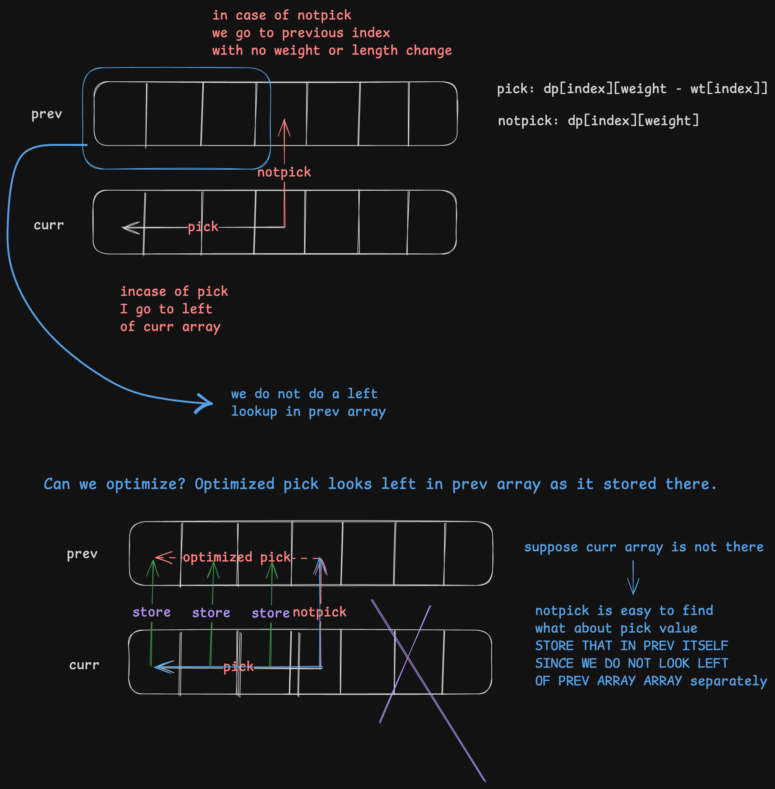

### Notes

* Follows exactly the unbounded knapsack pattern.
* Pick and not pick approach.
* Infinite supply of index or pieces to cut the rod (infinite supply of items).
* Single array space optimization works.

Lets suppose prev and curr are present, we are standing ar curr array index - if pick we move to the left in curr array and if not pick we move to the prev array index. We never lookup for left of prev array (unused). Therefore we can reuse prev array indices by storing curr array results over there.

[Rod cutting problem - Unbounded Knapsack Pattern](https://www.google.com)